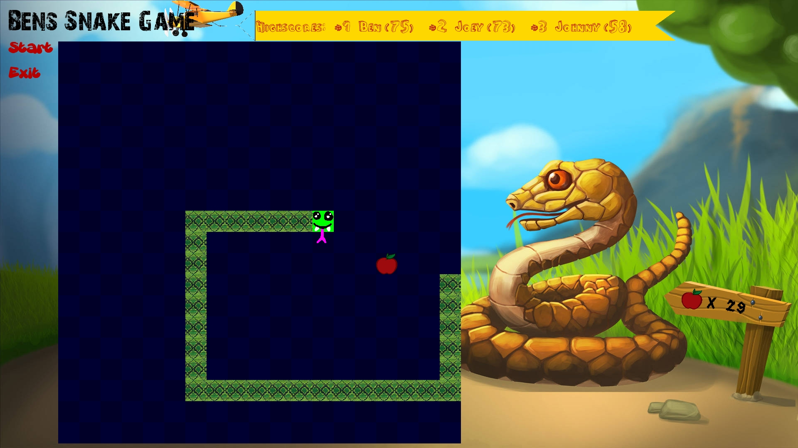

# Bens Snake Game



This is a simple snake game made with C++ and SDL2.<br>
The intention of this project is to try out the SDL2 library.

Furthermore, this game provides funny textures, sounds, a highscore display and a two player mode.

## How to play

### One player mode

The snake is controlled by the arrow buttons of the keyboard.

The goal is to get as many apples as possible to reach a new highscore.

The snake grows up for each eaten apple.

### Two player mode

Player one controls his snake by the arrow buttons of the keyboard.<br>
Player two controls his snake by buttons WASD of the keyboard.

You win if you keep your snake alive longer than your opponent.

The snakes grow up per time.

## Requirements

### Required tools

- gcc compiler
- cmake

For Debian distributions, cmake can be installed like this.

```
apt install cmake
```

### Required libraries

- SDL2 (V2.30.0)
- SDL2-image (V2.8.2)
- SDL2-ttf (V2.22.0)
- SDL2-mixer (V2.8.0)

For Debian distributions, these libraries can be installed like this.

```
apt install libsdl2-dev libsdl2-image-dev libsdl2-ttf-dev libsdl2-mixer-dev
```

## Build the game

With all required tools and libraries installed, the build can be executed like this.

```
cmake -B build
cmake --build build
```

## Run the game

After the game is built successfully, it can be started like this.

```
cd ./build
./Bens-Snake-Game
```

To run the game in windowed mode, this can be accomplished by passing the desired resolution as argument `<width>x<height>`, for example:<br>
`./Bens-Snake-Game 800x600`